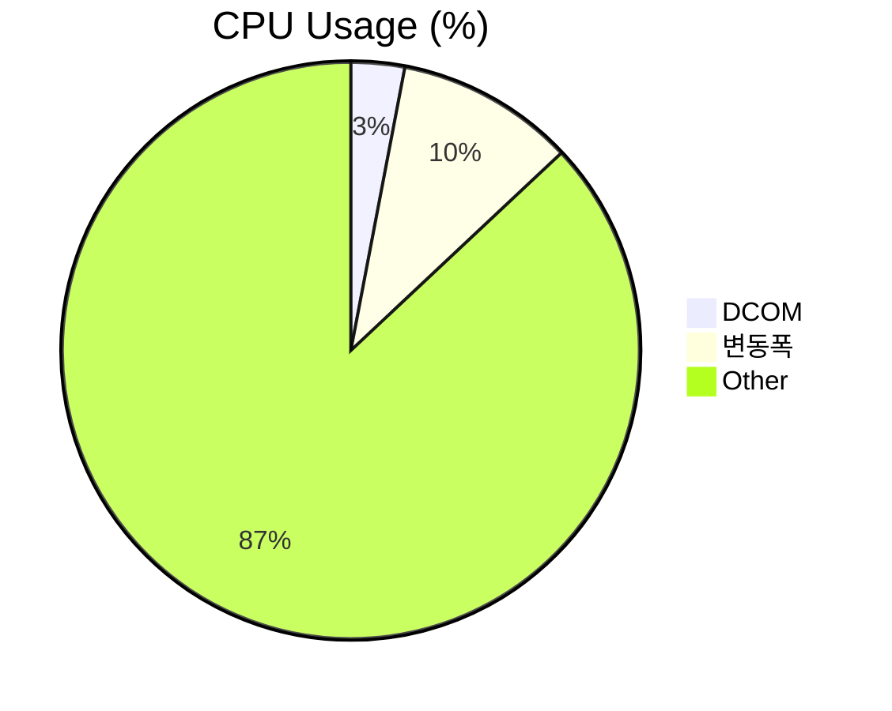
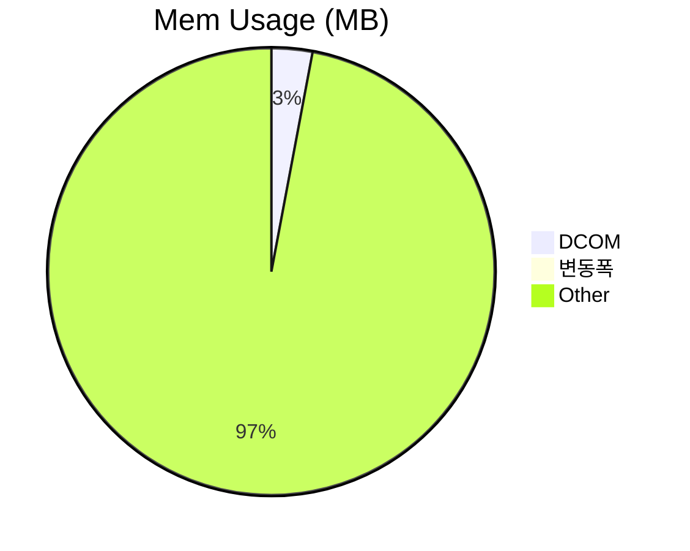
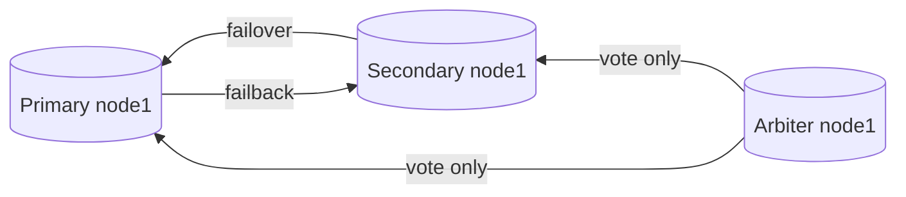

##   성능 테스트 보고서
    
      
**프로젝트 정보:**  
    
-   프로젝트 이름: DCOM
-   테스트 날짜: 2023-09-05
-   테스트 버전:
	- bbab62eebb8fb78c0ecb0200093132470f1bf27d (dev)
    
      
  **목표와 요약:**  
    
-   성능 테스트의 목표: 메모리누수 탐지 부하 과다경로 탐색
-   테스트 결과 요약: ***누수없음***, ***DatabaseBackgroundService에서 병목***
    ```mermaid 
    pie
    title CPU Usage (%)
    "Dcom" : 25
    "변동폭" : 7
    "Other" : 70
    ```
    ```mermaid 
    pie
    title Mem Usage (MB)
    "Dcom" : 158
    "변동폭": 30
    "Other" : 8000
    ```
    
      
**테스트 환경:**  
    
-   운영 체제: Win 10 pro
-   CPU: i3 6300
-   RAM: 8 Gb
-   그래픽 카드: N/A
-   .NET Framework 버전: 4.7.2
    
      
**테스트 시나리오:**  
    
-   테스트 시나리오 설명:  ***프로그램을 시작하며 메인화면에서 Idle상태 유지***
-   사용된 데이터 또는 시나리오:
	- [x] release 빌드 옵션으로 성능프로파일러 실행
	- [x] 메모리 사용량 기록
	- [x] 파일 읽기/ 쓰기 기록
	- [x] CPU사용량 기록
	- [x] 실행 부하 과다경로 탐색

**성능 측정 및 결과:**
-   테스트 시간: 2h
-   화면 응답 시간: 2h
-   CPU 사용률: 25~30 %
-   메모리 사용: 158 ~188 MB
-   네트워크 사용 (필요한 경우): 0.1 Mbps
    
      
**성능 문제 식별:**  
    
-   발견된 성능 문제:  ***실행 부하 과다 경로***
	|| + DCOM.Services.DatabaseBackgroundService.Worker_DoWork(object, System.ComponentModel.DoWorkEventArgs)	7042790(91.40%)


	
-   문제의 원인 분석: Loop주기가 매우 빠름. 다른 스레드에게 CPU Yield가 필요
-   추가 세부 정보: UI가 아닌 Background이기 때문에 Thread.Sleep()사용시 프리징 없이 효과적으로 CPU사용률을 낮출 수 있음.
      
**문제 해결 및 최적화:**  
    
-   채택된 해결책: Thread.Sleep()의 사용.
-   최적화된 코드 또는 구조 변경 내용:

<div class="colorscripter-code" style="color:#f0f0f0;font-family:Consolas, 'Liberation Mono', Menlo, Courier, monospace !important; position:relative !important;overflow:auto"><table class="colorscripter-code-table" style="margin:0;padding:0;border:none;background-color:#272727;border-radius:4px;" cellspacing="0" cellpadding="0"><tr><td style="padding:6px;border-right:2px solid #4f4f4f"><div style="margin:0;padding:0;word-break:normal;text-align:right;color:#aaa;font-family:Consolas, 'Liberation Mono', Menlo, Courier, monospace !important;line-height:130%"><div style="line-height:130%">1</div><div style="line-height:130%">2</div><div style="line-height:130%">3</div><div style="line-height:130%">4</div><div style="line-height:130%">5</div><div style="line-height:130%">6</div><div style="line-height:130%">7</div><div style="line-height:130%">8</div><div style="line-height:130%">9</div><div style="line-height:130%">10</div><div style="line-height:130%">11</div><div style="line-height:130%">12</div><div style="line-height:130%">13</div><div style="line-height:130%">14</div><div style="line-height:130%">15</div><div style="line-height:130%">16</div><div style="line-height:130%">17</div><div style="line-height:130%">18</div><div style="line-height:130%">19</div><div style="line-height:130%">20</div><div style="line-height:130%">21</div><div style="line-height:130%">22</div><div style="line-height:130%">23</div><div style="line-height:130%">24</div><div style="line-height:130%">25</div><div style="line-height:130%">26</div><div style="line-height:130%">27</div><div style="line-height:130%">28</div><div style="line-height:130%">29</div><div style="line-height:130%">30</div></div></td><td style="padding:6px 0;text-align:left"><div style="margin:0;padding:0;color:#f0f0f0;font-family:Consolas, 'Liberation Mono', Menlo, Courier, monospace !important;line-height:130%"><div style="padding:0 6px; white-space:pre; line-height:130%"><span style="color:#ff3399">while</span>&nbsp;(<span style="color:#0086b3"></span><span style="color:#ff3399">!</span>worker.CancellationPending)</div><div style="padding:0 6px; white-space:pre; line-height:130%">&nbsp;{</div><div style="padding:0 6px; white-space:pre; line-height:130%">&nbsp;&nbsp;&nbsp;&nbsp;&nbsp;<span style="color:#ff3399">if</span>&nbsp;(_enableWhileLoop)</div><div style="padding:0 6px; white-space:pre; line-height:130%">&nbsp;&nbsp;&nbsp;&nbsp;&nbsp;{</div><div style="padding:0 6px; white-space:pre; line-height:130%">&nbsp;&nbsp;&nbsp;&nbsp;&nbsp;&nbsp;&nbsp;&nbsp;&nbsp;<span style="color:#999999">//&nbsp;DB작업시&nbsp;메인스레드의&nbsp;네트워크작업에&nbsp;제동걸림&nbsp;DB와&nbsp;관련없는&nbsp;작업돌릴것.&nbsp;&nbsp;</span></div><div style="padding:0 6px; white-space:pre; line-height:130%">&nbsp;&nbsp;&nbsp;&nbsp;&nbsp;&nbsp;&nbsp;&nbsp;&nbsp;var&nbsp;passageOfTime&nbsp;<span style="color:#0086b3"></span><span style="color:#ff3399">=</span>&nbsp;DateTime.Now&nbsp;<span style="color:#0086b3"></span><span style="color:#ff3399">-</span>&nbsp;_lastLoofTime;</div><div style="padding:0 6px; white-space:pre; line-height:130%">&nbsp;&nbsp;&nbsp;&nbsp;&nbsp;&nbsp;&nbsp;&nbsp;&nbsp;<span style="color:#ff3399">if</span>&nbsp;(passageOfTime&nbsp;<span style="color:#0086b3"></span><span style="color:#ff3399">&gt;</span>&nbsp;OneTick)</div><div style="padding:0 6px; white-space:pre; line-height:130%">&nbsp;&nbsp;&nbsp;&nbsp;&nbsp;&nbsp;&nbsp;&nbsp;&nbsp;{</div><div style="padding:0 6px; white-space:pre; line-height:130%">&nbsp;&nbsp;&nbsp;&nbsp;&nbsp;&nbsp;&nbsp;&nbsp;&nbsp;&nbsp;&nbsp;&nbsp;&nbsp;var&nbsp;previous&nbsp;<span style="color:#0086b3"></span><span style="color:#ff3399">=</span>&nbsp;_role;</div><div style="padding:0 6px; white-space:pre; line-height:130%">&nbsp;&nbsp;&nbsp;&nbsp;&nbsp;&nbsp;&nbsp;&nbsp;&nbsp;&nbsp;&nbsp;&nbsp;&nbsp;CheckRole();</div><div style="padding:0 6px; white-space:pre; line-height:130%">&nbsp;&nbsp;&nbsp;&nbsp;&nbsp;&nbsp;&nbsp;&nbsp;&nbsp;&nbsp;&nbsp;&nbsp;&nbsp;<span style="color:#ff3399">if</span>&nbsp;(_role&nbsp;<span style="color:#0086b3"></span><span style="color:#ff3399">!</span><span style="color:#0086b3"></span><span style="color:#ff3399">=</span>&nbsp;previous)</div><div style="padding:0 6px; white-space:pre; line-height:130%">&nbsp;&nbsp;&nbsp;&nbsp;&nbsp;&nbsp;&nbsp;&nbsp;&nbsp;&nbsp;&nbsp;&nbsp;&nbsp;{</div><div style="padding:0 6px; white-space:pre; line-height:130%">&nbsp;&nbsp;&nbsp;&nbsp;&nbsp;&nbsp;&nbsp;&nbsp;&nbsp;&nbsp;&nbsp;&nbsp;&nbsp;&nbsp;&nbsp;&nbsp;&nbsp;<span style="color:#ff3399">string</span>&nbsp;json&nbsp;<span style="color:#0086b3"></span><span style="color:#ff3399">=</span>&nbsp;$<span style="color:#ffd500">"{{\"previous\":\"{previous}\"}},{{\"changed\":\"{_role}\"}}"</span>;</div><div style="padding:0 6px; white-space:pre; line-height:130%">&nbsp;&nbsp;&nbsp;&nbsp;&nbsp;&nbsp;&nbsp;&nbsp;&nbsp;&nbsp;&nbsp;&nbsp;&nbsp;&nbsp;&nbsp;&nbsp;&nbsp;<span style="color:#ff3399">object</span>&nbsp;fulldocument&nbsp;<span style="color:#0086b3"></span><span style="color:#ff3399">=</span>&nbsp;BsonDocument.TryParse(json,&nbsp;<span style="color:#ff3399">out</span>&nbsp;BsonDocument&nbsp;bson)&nbsp;?&nbsp;(<span style="color:#ff3399">object</span>)bson&nbsp;:&nbsp;(<span style="color:#ff3399">object</span>)json;</div><div style="padding:0 6px; white-space:pre; line-height:130%">&nbsp;&nbsp;&nbsp;&nbsp;&nbsp;&nbsp;&nbsp;&nbsp;&nbsp;&nbsp;&nbsp;&nbsp;&nbsp;&nbsp;&nbsp;&nbsp;&nbsp;var&nbsp;sucess&nbsp;<span style="color:#0086b3"></span><span style="color:#ff3399">=</span>_databaseManager.Insert(DATABASE_NAME,&nbsp;COLLECTION_FAILOVER,&nbsp;<span style="color:#ff3399">new</span>&nbsp;BsonDocument(<span style="color:#ff3399">new</span>&nbsp;KeyValuePair<span style="color:#0086b3"></span><span style="color:#ff3399">&lt;</span><span style="color:#ff3399">string</span>,&nbsp;<span style="color:#ff3399">object</span><span style="color:#ff3399">&gt;</span>[]</div><div style="padding:0 6px; white-space:pre; line-height:130%">&nbsp;&nbsp;&nbsp;&nbsp;&nbsp;&nbsp;&nbsp;&nbsp;&nbsp;&nbsp;&nbsp;&nbsp;&nbsp;&nbsp;&nbsp;&nbsp;&nbsp;{</div><div style="padding:0 6px; white-space:pre; line-height:130%">&nbsp;&nbsp;&nbsp;&nbsp;&nbsp;&nbsp;&nbsp;&nbsp;&nbsp;&nbsp;&nbsp;&nbsp;&nbsp;&nbsp;&nbsp;&nbsp;&nbsp;&nbsp;&nbsp;&nbsp;&nbsp;<span style="color:#ff3399">new</span>&nbsp;KeyValuePair<span style="color:#0086b3"></span><span style="color:#ff3399">&lt;</span><span style="color:#ff3399">string</span>,&nbsp;<span style="color:#ff3399">object</span><span style="color:#ff3399">&gt;</span>(<span style="color:#ffd500">"_id"</span>,&nbsp;ObjectId.GenerateNewId()),</div><div style="padding:0 6px; white-space:pre; line-height:130%">&nbsp;&nbsp;&nbsp;&nbsp;&nbsp;&nbsp;&nbsp;&nbsp;&nbsp;&nbsp;&nbsp;&nbsp;&nbsp;&nbsp;&nbsp;&nbsp;&nbsp;&nbsp;&nbsp;&nbsp;&nbsp;<span style="color:#ff3399">new</span>&nbsp;KeyValuePair<span style="color:#0086b3"></span><span style="color:#ff3399">&lt;</span><span style="color:#ff3399">string</span>,&nbsp;<span style="color:#ff3399">object</span><span style="color:#ff3399">&gt;</span>(<span style="color:#ffd500">"specification"</span>,&nbsp;<span style="color:#ffd500">"Changed&nbsp;system-role"</span>),</div><div style="padding:0 6px; white-space:pre; line-height:130%">&nbsp;&nbsp;&nbsp;&nbsp;&nbsp;&nbsp;&nbsp;&nbsp;&nbsp;&nbsp;&nbsp;&nbsp;&nbsp;&nbsp;&nbsp;&nbsp;&nbsp;&nbsp;&nbsp;&nbsp;&nbsp;<span style="color:#ff3399">new</span>&nbsp;KeyValuePair<span style="color:#0086b3"></span><span style="color:#ff3399">&lt;</span><span style="color:#ff3399">string</span>,&nbsp;<span style="color:#ff3399">object</span><span style="color:#ff3399">&gt;</span>(FIELD_FULLDOCUMENT,&nbsp;fulldocument),</div><div style="padding:0 6px; white-space:pre; line-height:130%">&nbsp;&nbsp;&nbsp;&nbsp;&nbsp;&nbsp;&nbsp;&nbsp;&nbsp;&nbsp;&nbsp;&nbsp;&nbsp;&nbsp;&nbsp;&nbsp;&nbsp;&nbsp;&nbsp;&nbsp;&nbsp;<span style="color:#ff3399">new</span>&nbsp;KeyValuePair<span style="color:#0086b3"></span><span style="color:#ff3399">&lt;</span><span style="color:#ff3399">string</span>,&nbsp;<span style="color:#ff3399">object</span><span style="color:#ff3399">&gt;</span>(<span style="color:#ffd500">"createdAt"</span>,&nbsp;DateTime.Now),</div><div style="padding:0 6px; white-space:pre; line-height:130%">&nbsp;&nbsp;&nbsp;&nbsp;&nbsp;&nbsp;&nbsp;&nbsp;&nbsp;&nbsp;&nbsp;&nbsp;&nbsp;&nbsp;&nbsp;&nbsp;&nbsp;&nbsp;&nbsp;&nbsp;&nbsp;<span style="color:#ff3399">new</span>&nbsp;KeyValuePair<span style="color:#0086b3"></span><span style="color:#ff3399">&lt;</span><span style="color:#ff3399">string</span>,&nbsp;<span style="color:#ff3399">object</span><span style="color:#ff3399">&gt;</span>(<span style="color:#ffd500">"createdBy"</span>,&nbsp;<span style="color:#4be6fa">System</span>.Net.Dns.GetHostName())</div><div style="padding:0 6px; white-space:pre; line-height:130%">&nbsp;&nbsp;&nbsp;&nbsp;&nbsp;&nbsp;&nbsp;&nbsp;&nbsp;&nbsp;&nbsp;&nbsp;&nbsp;&nbsp;&nbsp;&nbsp;&nbsp;}));</div><div style="padding:0 6px; white-space:pre; line-height:130%">&nbsp;&nbsp;&nbsp;&nbsp;&nbsp;&nbsp;&nbsp;&nbsp;&nbsp;&nbsp;&nbsp;&nbsp;&nbsp;&nbsp;&nbsp;&nbsp;&nbsp;DCOMInformation.Log.WriteLog($<span style="color:#ffd500">"The&nbsp;system&nbsp;has&nbsp;been&nbsp;changed&nbsp;by&nbsp;failover&nbsp;({json})&nbsp;[{System.Net.Dns.GetHostName()}]"</span>,&nbsp;<span style="color:#ff3399">this</span>.GetType().Name,&nbsp;<span style="color:#ffd500">"Database"</span>,&nbsp;LogManager.KindLog.Debug);</div><div style="padding:0 6px; white-space:pre; line-height:130%">&nbsp;&nbsp;&nbsp;&nbsp;&nbsp;&nbsp;&nbsp;&nbsp;&nbsp;&nbsp;&nbsp;&nbsp;&nbsp;}</div><div style="padding:0 6px; white-space:pre; line-height:130%">&nbsp;&nbsp;&nbsp;&nbsp;&nbsp;&nbsp;&nbsp;&nbsp;&nbsp;&nbsp;&nbsp;&nbsp;&nbsp;_lastLoofTime&nbsp;<span style="color:#0086b3"></span><span style="color:#ff3399">=</span>&nbsp;DateTime.Now;</div><div style="padding:0 6px; white-space:pre; line-height:130%">&nbsp;&nbsp;&nbsp;&nbsp;&nbsp;&nbsp;&nbsp;&nbsp;&nbsp;}</div><div style="padding:0 6px; white-space:pre; line-height:130%">&nbsp;&nbsp;&nbsp;&nbsp;&nbsp;}</div><div style="padding:0 6px; white-space:pre; line-height:130%">&nbsp;&nbsp;&nbsp;&nbsp;&nbsp;<span style="color:#999999">//코드추가&nbsp;**변경**</span></div><div style="padding:0 6px; white-space:pre; line-height:130%">&nbsp;&nbsp;&nbsp;&nbsp;&nbsp;<span style="color:#4be6fa">Thread</span>.Sleep(OneTick);</div><div style="padding:0 6px; white-space:pre; line-height:130%">&nbsp;}</div></div><div style="text-align:right;margin-top:-13px;margin-right:5px;font-size:9px;font-style:italic"><a href="http://colorscripter.com/info#e" target="_blank" style="color:#4f4f4ftext-decoration:none">Colored by Color Scripter</a></div></td><td style="vertical-align:bottom;padding:0 2px 4px 0"><a href="http://colorscripter.com/info#e" target="_blank" style="text-decoration:none;color:white"><span style="font-size:9px;word-break:normal;background-color:#4f4f4f;color:white;border-radius:10px;padding:1px">cs</span></a></td></tr></table></div>

-   성능 향상 결과: **Mem 소폭상승,  but CPU 대폭하락**


      
**추가 테스트 및 작업:**  
    
-   추가 테스트 또는 작업 요청 (필요한 경우): ***파일 읽기/쓰기는 크게 영향이 없으므로 다음 테스트 부터는 제외***
      
**결론:**  
    
-   성능 테스트 결과에 대한 종합적인 결론: 
	-  되게 사소한 한줄로 기존 CPU사용률의 70% ~ 90%를 절감했다. 
	- 원인은 비동기쓰레드에서의 Loop였고, ~~백그라운드 라이브러리 사용으로 커널에서 CPU가 IDLE상태일 때 동작한다는~~ 믿음은 깨졌다. 
	- 실행 부하 과다 경로가 만약 시스템 코드나 Nuget라이브러리 코드가 아닌, **우리가 작성한 코드**면 포기하지 않고 개선 해야할 것.
	- 메모리사용량은 소폭 상승했으나 허용할 만한 수준이므로, 이 후 테스트의 경과를 관망 후 조치 하기위해 보류한다.
      
**다음 단계:**  
    
-   추가 작업 또는 개선사항에 대한 계획: 메인메뉴버튼을 누르면서 성능분석
      
**서명:**  

-   보고서 작성자: 주호연
-   작성일: 2023-09-05

# MongoDB Replica Set 구성


## Primary Node1
- Host: ICMS1
- Port: 27017
- 상태: Primary
- 역할: 데이터 쓰기 가능

## Secondary Node1
- Host: ICMS2
- Port: 27017
- 상태: Secondary
- 역할: 데이터 복제 및 읽기 가능

## Arbiter Node1
- Host: ICMS3
- Port: 27017
- 상태: Arbiter
- 역할: 투표자 (데이터 복제 불가능)
