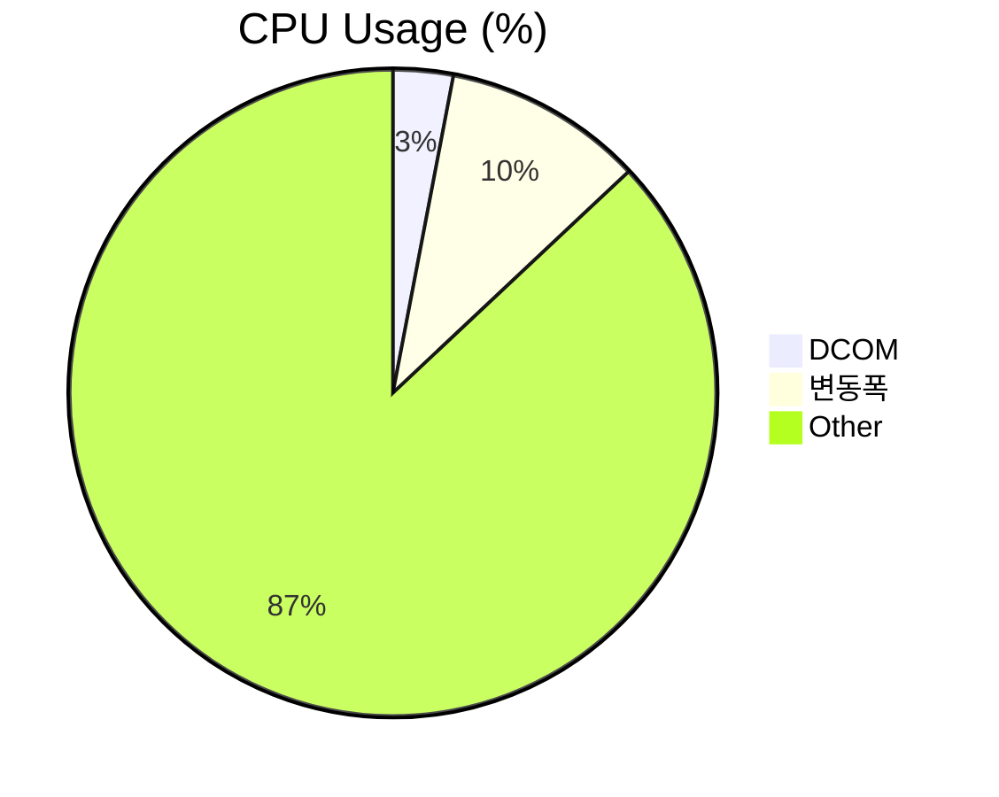
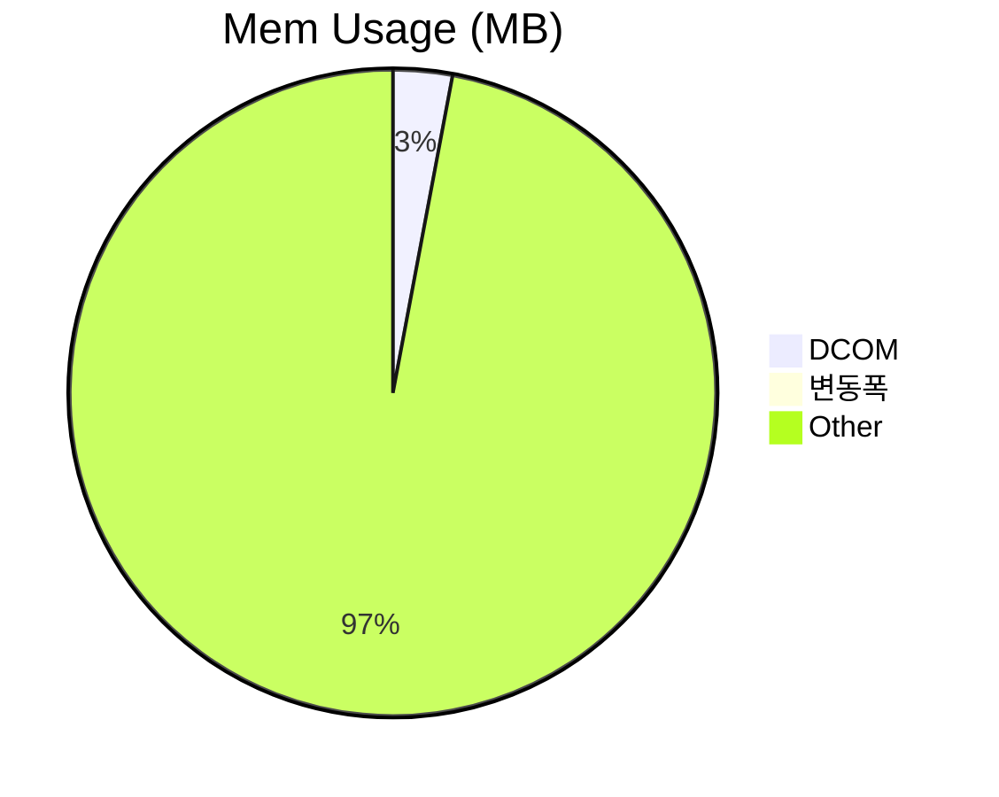
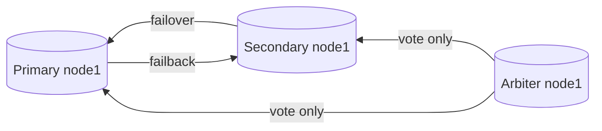

##   성능 테스트 보고서
    
      
**프로젝트 정보:**  
    
-   프로젝트 이름: DCOM
-   테스트 날짜: 2023-09-05
-   테스트 버전:
	- bbab62eebb8fb78c0ecb0200093132470f1bf27d (dev)
    
      
  **목표와 요약:**  
    
-   성능 테스트의 목표: 메모리누수 탐지 부하 과다경로 탐색
-   테스트 결과 요약: ***누수없음***, ***DatabaseBackgroundService에서 병목***
    ```mermaid 
    pie
    title CPU Usage (%)
    "Dcom" : 25
    "변동폭" : 7
    "Other" : 70
    ```
    ```mermaid 
    pie
    title Mem Usage (MB)
    "Dcom" : 158
    "변동폭": 30
    "Other" : 8000
    ```
    
      
**테스트 환경:**  
    
-   운영 체제: Win 10 pro
-   CPU: i3 6300
-   RAM: 8 Gb
-   그래픽 카드: N/A
-   .NET Framework 버전: 4.7.2
    
      
**테스트 시나리오:**  
    
-   테스트 시나리오 설명:  ***프로그램을 시작하며 메인화면에서 Idle상태 유지***
-   사용된 데이터 또는 시나리오:
	- [x] release 빌드 옵션으로 성능프로파일러 실행
	- [x] 메모리 사용량 기록
	- [x] 파일 읽기/ 쓰기 기록
	- [x] CPU사용량 기록
	- [x] 실행 부하 과다경로 탐색

**성능 측정 및 결과:**
-   테스트 시간: 2h
-   화면 응답 시간: 2h
-   CPU 사용률: 25~30 %
-   메모리 사용: 158 ~188 MB
-   네트워크 사용 (필요한 경우): 0.1 Mbps
    
      
**성능 문제 식별:**  
    
-   발견된 성능 문제:  ***실행 부하 과다 경로***
	|| + DCOM.Services.DatabaseBackgroundService.Worker_DoWork(object, System.ComponentModel.DoWorkEventArgs)	7042790(91.40%)


	
-   문제의 원인 분석: Loop주기가 매우 빠름. 다른 스레드에게 CPU Yield가 필요
-   추가 세부 정보: UI가 아닌 Background이기 때문에 Thread.Sleep()사용시 프리징 없이 효과적으로 CPU사용률을 낮출 수 있음.
      
**문제 해결 및 최적화:**  
    
-   채택된 해결책: Thread.Sleep()의 사용.
-   최적화된 코드 또는 구조 변경 내용:

```csharp:DatabaseBackgroundService.cs
 // 백그라운드 작업 수행
 while (!worker.CancellationPending)
 {
     if (_enableWhileLoop)
     {
         // DB작업시 메인스레드의 네트워크작업에 제동걸림 DB와 관련없는 작업돌릴것.  
         var passageOfTime = DateTime.Now - _lastLoofTime;
         if (passageOfTime > OneTick)
         {
             var previous = _role;
             CheckRole();
             if (_role != previous)
             {
                 string json = $"{{\"previous\":\"{previous}\"}},{{\"changed\":\"{_role}\"}}";
                 object fulldocument = BsonDocument.TryParse(json, out BsonDocument bson) ? (object)bson : (object)json;
                 var sucess =_databaseManager.Insert(DATABASE_NAME, COLLECTION_FAILOVER, new BsonDocument(new KeyValuePair<string, object>[]
                 {
                     new KeyValuePair<string, object>("_id", ObjectId.GenerateNewId()),
                     new KeyValuePair<string, object>("specification", "Changed system-role"),
                     new KeyValuePair<string, object>(FIELD_FULLDOCUMENT, fulldocument),
                     new KeyValuePair<string, object>("createdAt", DateTime.Now),
                     new KeyValuePair<string, object>("createdBy", System.Net.Dns.GetHostName())
                 }));
                 DCOMInformation.Log.WriteLog($"The system has been changed by failover ({json}) [{System.Net.Dns.GetHostName()}]", this.GetType().Name, "Database", LogManager.KindLog.Debug);
             }
             _lastLoofTime = DateTime.Now;
         }
     }
     //코드추가 **변경**
     Thread.Sleep(OneTick);
 }
```
-   성능 향상 결과: **Mem 소폭상승,  but CPU 대폭하락**


      
**추가 테스트 및 작업:**  
    
-   추가 테스트 또는 작업 요청 (필요한 경우): ***파일 읽기/쓰기는 크게 영향이 없으므로 다음 테스트 부터는 제외***
      
**결론:**  
    
-   성능 테스트 결과에 대한 종합적인 결론: 
	-  되게 사소한 한줄로 기존 CPU사용률의 70% ~ 90%를 절감했다. 
	- 원인은 비동기쓰레드에서의 Loop였고, ~~백그라운드 라이브러리 사용으로 커널에서 CPU가 IDLE상태일 때 동작한다는~~ 믿음은 깨졌다. 
	- 실행 부하 과다 경로가 만약 시스템 코드나 Nuget라이브러리 코드가 아닌, **우리가 작성한 코드**면 포기하지 않고 개선 해야할 것.
	- 메모리사용량은 소폭 상승했으나 허용할 만한 수준이므로, 이 후 테스트의 경과를 관망 후 조치 하기위해 보류한다.
      
**다음 단계:**  
    
-   추가 작업 또는 개선사항에 대한 계획: 메인메뉴버튼을 누르면서 성능분석
      
**서명:**  

-   보고서 작성자: 주호연
-   작성일: 2023-09-05

# MongoDB Replica Set 구성


## Primary Node1
- Host: ICMS1
- Port: 27017
- 상태: Primary
- 역할: 데이터 쓰기 가능

## Secondary Node1
- Host: ICMS2
- Port: 27017
- 상태: Secondary
- 역할: 데이터 복제 및 읽기 가능

## Arbiter Node1
- Host: ICMS3
- Port: 27017
- 상태: Arbiter
- 역할: 투표자 (데이터 복제 불가능)---


---

<h2 id="성능-테스트-보고서">성능 테스트 보고서</h2>
<p><strong>프로젝트 정보:</strong></p>
<ul>
<li>프로젝트 이름: DCOM</li>
<li>테스트 날짜: 2023-09-05</li>
<li>테스트 버전:
<ul>
<li>bbab62eebb8fb78c0ecb0200093132470f1bf27d (dev)</li>
</ul>
</li>
</ul>
<p><strong>목표와 요약:</strong></p>
<ul>
<li>성능 테스트의 목표: 메모리누수 탐지 부하 과다경로 탐색</li>
<li>테스트 결과 요약: <em><strong>누수없음</strong></em>, <em><strong>DatabaseBackgroundService에서 병목</strong></em><pre class=" language-mermaid"><svg id="mermaid-svg-plHbRv2pCF6Yx130" width="100%" xmlns="http://www.w3.org/2000/svg" height="450" style="max-width: 500px;" viewBox="0 0 500 450"><style>#mermaid-svg-plHbRv2pCF6Yx130{font-family:"trebuchet ms",verdana,arial,sans-serif;font-size:16px;fill:#000000;}#mermaid-svg-plHbRv2pCF6Yx130 .error-icon{fill:#552222;}#mermaid-svg-plHbRv2pCF6Yx130 .error-text{fill:#552222;stroke:#552222;}#mermaid-svg-plHbRv2pCF6Yx130 .edge-thickness-normal{stroke-width:2px;}#mermaid-svg-plHbRv2pCF6Yx130 .edge-thickness-thick{stroke-width:3.5px;}#mermaid-svg-plHbRv2pCF6Yx130 .edge-pattern-solid{stroke-dasharray:0;}#mermaid-svg-plHbRv2pCF6Yx130 .edge-pattern-dashed{stroke-dasharray:3;}#mermaid-svg-plHbRv2pCF6Yx130 .edge-pattern-dotted{stroke-dasharray:2;}#mermaid-svg-plHbRv2pCF6Yx130 .marker{fill:#666;stroke:#666;}#mermaid-svg-plHbRv2pCF6Yx130 .marker.cross{stroke:#666;}#mermaid-svg-plHbRv2pCF6Yx130 svg{font-family:"trebuchet ms",verdana,arial,sans-serif;font-size:16px;}#mermaid-svg-plHbRv2pCF6Yx130 .pieTitleText{text-anchor:middle;font-size:25px;fill:#333;font-family:"trebuchet ms",verdana,arial,sans-serif;}#mermaid-svg-plHbRv2pCF6Yx130 .slice{font-family:"trebuchet ms",verdana,arial,sans-serif;fill:#000000;}#mermaid-svg-plHbRv2pCF6Yx130 .legend text{fill:#333;font-family:"trebuchet ms",verdana,arial,sans-serif;font-size:17px;}#mermaid-svg-plHbRv2pCF6Yx130:root{--mermaid-font-family:"trebuchet ms",verdana,arial,sans-serif;}#mermaid-svg-plHbRv2pCF6Yx130 pie{fill:apa;}</style><g></g><g transform="translate(250,225)"><path d="M-170.36752081981643,72.11038655914565A185,185,0,0,1,-77.32266380405491,-168.0660752866119L0,0Z" fill="#66c2a5" stroke="black" style="stroke-width: 2px; opacity: 0.7;"></path><path d="M-77.32266380405491,-168.0660752866119A185,185,0,0,1,-3.398394867633905e-14,-185L0,0Z" fill="#fc8d62" stroke="black" style="stroke-width: 2px; opacity: 0.7;"></path><path d="M1.1327982892113017e-14,-185A185,185,0,1,1,-170.36752081981643,72.11038655914565L0,0Z" fill="#8da0cb" stroke="black" style="stroke-width: 2px; opacity: 0.7;"></path><text transform="translate(-86.25368121990289,-33.414854122311695)" class="slice" style="text-anchor: middle; font-size: 17px;">25%</text><text transform="translate(-19.78881019660105,-90.35846939276306)" class="slice" style="text-anchor: middle; font-size: 17px;">7%</text><text transform="translate(77.10822063295355,51.0937599988468)" class="slice" style="text-anchor: middle; font-size: 17px;">69%</text><text x="0" y="-200" class="pieTitleText">CPU Usage (%)</text><g class="legend" transform="translate(216,-33)"><rect width="18" height="18" style="fill: rgb(102, 194, 165); stroke: rgb(102, 194, 165);"></rect><text x="22" y="14">Dcom</text></g><g class="legend" transform="translate(216,-11)"><rect width="18" height="18" style="fill: rgb(252, 141, 98); stroke: rgb(252, 141, 98);"></rect><text x="22" y="14">변동폭</text></g><g class="legend" transform="translate(216,11)"><rect width="18" height="18" style="fill: rgb(141, 160, 203); stroke: rgb(141, 160, 203);"></rect><text x="22" y="14">Other</text></g></g></svg></pre>
<pre class=" language-mermaid"><svg id="mermaid-svg-9nAUf2R7UuMet2my" width="100%" xmlns="http://www.w3.org/2000/svg" height="450" style="max-width: 500px;" viewBox="0 0 500 450"><style>#mermaid-svg-9nAUf2R7UuMet2my{font-family:"trebuchet ms",verdana,arial,sans-serif;font-size:16px;fill:#000000;}#mermaid-svg-9nAUf2R7UuMet2my .error-icon{fill:#552222;}#mermaid-svg-9nAUf2R7UuMet2my .error-text{fill:#552222;stroke:#552222;}#mermaid-svg-9nAUf2R7UuMet2my .edge-thickness-normal{stroke-width:2px;}#mermaid-svg-9nAUf2R7UuMet2my .edge-thickness-thick{stroke-width:3.5px;}#mermaid-svg-9nAUf2R7UuMet2my .edge-pattern-solid{stroke-dasharray:0;}#mermaid-svg-9nAUf2R7UuMet2my .edge-pattern-dashed{stroke-dasharray:3;}#mermaid-svg-9nAUf2R7UuMet2my .edge-pattern-dotted{stroke-dasharray:2;}#mermaid-svg-9nAUf2R7UuMet2my .marker{fill:#666;stroke:#666;}#mermaid-svg-9nAUf2R7UuMet2my .marker.cross{stroke:#666;}#mermaid-svg-9nAUf2R7UuMet2my svg{font-family:"trebuchet ms",verdana,arial,sans-serif;font-size:16px;}#mermaid-svg-9nAUf2R7UuMet2my .pieTitleText{text-anchor:middle;font-size:25px;fill:#333;font-family:"trebuchet ms",verdana,arial,sans-serif;}#mermaid-svg-9nAUf2R7UuMet2my .slice{font-family:"trebuchet ms",verdana,arial,sans-serif;fill:#000000;}#mermaid-svg-9nAUf2R7UuMet2my .legend text{fill:#333;font-family:"trebuchet ms",verdana,arial,sans-serif;font-size:17px;}#mermaid-svg-9nAUf2R7UuMet2my:root{--mermaid-font-family:"trebuchet ms",verdana,arial,sans-serif;}#mermaid-svg-9nAUf2R7UuMet2my pie{fill:apa;}</style><g></g><g transform="translate(250,225)"><path d="M-26.596477541489275,-183.07820018337807A185,185,0,0,1,-4.258500050392736,-184.95098047136923L0,0Z" fill="#66c2a5" stroke="black" style="stroke-width: 2px; opacity: 0.7;"></path><path d="M-4.258500050392736,-184.95098047136923A185,185,0,0,1,-3.398394867633905e-14,-185L0,0Z" fill="#fc8d62" stroke="black" style="stroke-width: 2px; opacity: 0.7;"></path><path d="M1.1327982892113017e-14,-185A185,185,0,1,1,-26.596477541489275,-183.07820018337807L0,0Z" fill="#8da0cb" stroke="black" style="stroke-width: 2px; opacity: 0.7;"></path><text transform="translate(-7.727940169454234,-92.17661818887335)" class="slice" style="text-anchor: middle; font-size: 17px;">2%</text><text transform="translate(-1.0646955431419822,-92.49387235595887)" class="slice" style="text-anchor: middle; font-size: 17px;">0%</text><text transform="translate(6.666454886923178,92.25946227482912)" class="slice" style="text-anchor: middle; font-size: 17px;">98%</text><text x="0" y="-200" class="pieTitleText">Mem Usage (MB)</text><g class="legend" transform="translate(216,-33)"><rect width="18" height="18" style="fill: rgb(102, 194, 165); stroke: rgb(102, 194, 165);"></rect><text x="22" y="14">Dcom</text></g><g class="legend" transform="translate(216,-11)"><rect width="18" height="18" style="fill: rgb(252, 141, 98); stroke: rgb(252, 141, 98);"></rect><text x="22" y="14">변동폭</text></g><g class="legend" transform="translate(216,11)"><rect width="18" height="18" style="fill: rgb(141, 160, 203); stroke: rgb(141, 160, 203);"></rect><text x="22" y="14">Other</text></g></g></svg></pre>
</li>
</ul>
<p><strong>테스트 환경:</strong></p>
<ul>
<li>운영 체제: Win 10 pro</li>
<li>CPU: i3 6300</li>
<li>RAM: 8 Gb</li>
<li>그래픽 카드: N/A</li>
<li>.NET Framework 버전: 4.7.2</li>
</ul>
<p><strong>테스트 시나리오:</strong></p>
<ul>
<li>테스트 시나리오 설명:  <em><strong>프로그램을 시작하며 메인화면에서 Idle상태 유지</strong></em></li>
<li>사용된 데이터 또는 시나리오:
<ul>
<li class="task-list-item"><input type="checkbox" class="task-list-item-checkbox" checked="true" disabled=""> release 빌드 옵션으로 성능프로파일러 실행</li>
<li class="task-list-item"><input type="checkbox" class="task-list-item-checkbox" checked="true" disabled=""> 메모리 사용량 기록</li>
<li class="task-list-item"><input type="checkbox" class="task-list-item-checkbox" checked="true" disabled=""> 파일 읽기/ 쓰기 기록</li>
<li class="task-list-item"><input type="checkbox" class="task-list-item-checkbox" checked="true" disabled=""> CPU사용량 기록</li>
<li class="task-list-item"><input type="checkbox" class="task-list-item-checkbox" checked="true" disabled=""> 실행 부하 과다경로 탐색</li>
</ul>
</li>
</ul>
<p><strong>성능 측정 및 결과:</strong></p>
<ul>
<li>테스트 시간: 2h</li>
<li>화면 응답 시간: 2h</li>
<li>CPU 사용률: 25~30 %</li>
<li>메모리 사용: 158 ~188 MB</li>
<li>네트워크 사용 (필요한 경우): 0.1 Mbps</li>
</ul>
<p><strong>성능 문제 식별:</strong></p>
<ul>
<li>발견된 성능 문제:  <em><strong>실행 부하 과다 경로</strong></em><br>
|| + DCOM.Services.DatabaseBackgroundService.Worker_DoWork(object, System.ComponentModel.DoWorkEventArgs)	7042790(91.40%)</li>
</ul>
<p></p>
<ul>
<li>문제의 원인 분석: Loop주기가 매우 빠름. 다른 스레드에게 CPU Yield가 필요</li>
<li>추가 세부 정보: UI가 아닌 Background이기 때문에 Thread.Sleep()사용시 프리징 없이 효과적으로 CPU사용률을 낮출 수 있음.</li>
</ul>
<p><strong>문제 해결 및 최적화:</strong></p>
<ul>
<li>채택된 해결책: Thread.Sleep()의 사용.</li>
<li>최적화된 코드 또는 구조 변경 내용:</li>
</ul>
<pre class=" language-csharp"><code class="prism :DatabaseBackgroundService.cs language-csharp"> <span class="token comment">// 백그라운드 작업 수행</span>
 <span class="token keyword">while</span> <span class="token punctuation">(</span><span class="token operator">!</span>worker<span class="token punctuation">.</span>CancellationPending<span class="token punctuation">)</span>
 <span class="token punctuation">{</span>
     <span class="token keyword">if</span> <span class="token punctuation">(</span>_enableWhileLoop<span class="token punctuation">)</span>
     <span class="token punctuation">{</span>
         <span class="token comment">// DB작업시 메인스레드의 네트워크작업에 제동걸림 DB와 관련없는 작업돌릴것.  </span>
         <span class="token keyword">var</span> passageOfTime <span class="token operator">=</span> DateTime<span class="token punctuation">.</span>Now <span class="token operator">-</span> _lastLoofTime<span class="token punctuation">;</span>
         <span class="token keyword">if</span> <span class="token punctuation">(</span>passageOfTime <span class="token operator">&gt;</span> OneTick<span class="token punctuation">)</span>
         <span class="token punctuation">{</span>
             <span class="token keyword">var</span> previous <span class="token operator">=</span> _role<span class="token punctuation">;</span>
             <span class="token function">CheckRole</span><span class="token punctuation">(</span><span class="token punctuation">)</span><span class="token punctuation">;</span>
             <span class="token keyword">if</span> <span class="token punctuation">(</span>_role <span class="token operator">!=</span> previous<span class="token punctuation">)</span>
             <span class="token punctuation">{</span>
                 <span class="token keyword">string</span> json <span class="token operator">=</span> $<span class="token string">"{{\"previous\":\"{previous}\"}},{{\"changed\":\"{_role}\"}}"</span><span class="token punctuation">;</span>
                 <span class="token keyword">object</span> fulldocument <span class="token operator">=</span> BsonDocument<span class="token punctuation">.</span><span class="token function">TryParse</span><span class="token punctuation">(</span>json<span class="token punctuation">,</span> <span class="token keyword">out</span> BsonDocument bson<span class="token punctuation">)</span> <span class="token operator">?</span> <span class="token punctuation">(</span><span class="token keyword">object</span><span class="token punctuation">)</span>bson <span class="token punctuation">:</span> <span class="token punctuation">(</span><span class="token keyword">object</span><span class="token punctuation">)</span>json<span class="token punctuation">;</span>
                 <span class="token keyword">var</span> sucess <span class="token operator">=</span>_databaseManager<span class="token punctuation">.</span><span class="token function">Insert</span><span class="token punctuation">(</span>DATABASE_NAME<span class="token punctuation">,</span> COLLECTION_FAILOVER<span class="token punctuation">,</span> <span class="token keyword">new</span> <span class="token class-name">BsonDocument</span><span class="token punctuation">(</span><span class="token keyword">new</span> <span class="token class-name">KeyValuePair</span><span class="token operator">&lt;</span><span class="token keyword">string</span><span class="token punctuation">,</span> <span class="token keyword">object</span><span class="token operator">&gt;</span><span class="token punctuation">[</span><span class="token punctuation">]</span>
                 <span class="token punctuation">{</span>
                     <span class="token keyword">new</span> <span class="token class-name">KeyValuePair</span><span class="token operator">&lt;</span><span class="token keyword">string</span><span class="token punctuation">,</span> <span class="token keyword">object</span><span class="token operator">&gt;</span><span class="token punctuation">(</span><span class="token string">"_id"</span><span class="token punctuation">,</span> ObjectId<span class="token punctuation">.</span><span class="token function">GenerateNewId</span><span class="token punctuation">(</span><span class="token punctuation">)</span><span class="token punctuation">)</span><span class="token punctuation">,</span>
                     <span class="token keyword">new</span> <span class="token class-name">KeyValuePair</span><span class="token operator">&lt;</span><span class="token keyword">string</span><span class="token punctuation">,</span> <span class="token keyword">object</span><span class="token operator">&gt;</span><span class="token punctuation">(</span><span class="token string">"specification"</span><span class="token punctuation">,</span> <span class="token string">"Changed system-role"</span><span class="token punctuation">)</span><span class="token punctuation">,</span>
                     <span class="token keyword">new</span> <span class="token class-name">KeyValuePair</span><span class="token operator">&lt;</span><span class="token keyword">string</span><span class="token punctuation">,</span> <span class="token keyword">object</span><span class="token operator">&gt;</span><span class="token punctuation">(</span>FIELD_FULLDOCUMENT<span class="token punctuation">,</span> fulldocument<span class="token punctuation">)</span><span class="token punctuation">,</span>
                     <span class="token keyword">new</span> <span class="token class-name">KeyValuePair</span><span class="token operator">&lt;</span><span class="token keyword">string</span><span class="token punctuation">,</span> <span class="token keyword">object</span><span class="token operator">&gt;</span><span class="token punctuation">(</span><span class="token string">"createdAt"</span><span class="token punctuation">,</span> DateTime<span class="token punctuation">.</span>Now<span class="token punctuation">)</span><span class="token punctuation">,</span>
                     <span class="token keyword">new</span> <span class="token class-name">KeyValuePair</span><span class="token operator">&lt;</span><span class="token keyword">string</span><span class="token punctuation">,</span> <span class="token keyword">object</span><span class="token operator">&gt;</span><span class="token punctuation">(</span><span class="token string">"createdBy"</span><span class="token punctuation">,</span> System<span class="token punctuation">.</span>Net<span class="token punctuation">.</span>Dns<span class="token punctuation">.</span><span class="token function">GetHostName</span><span class="token punctuation">(</span><span class="token punctuation">)</span><span class="token punctuation">)</span>
                 <span class="token punctuation">}</span><span class="token punctuation">)</span><span class="token punctuation">)</span><span class="token punctuation">;</span>
                 DCOMInformation<span class="token punctuation">.</span>Log<span class="token punctuation">.</span><span class="token function">WriteLog</span><span class="token punctuation">(</span>$<span class="token string">"The system has been changed by failover ({json}) [{System.Net.Dns.GetHostName()}]"</span><span class="token punctuation">,</span> <span class="token keyword">this</span><span class="token punctuation">.</span><span class="token function">GetType</span><span class="token punctuation">(</span><span class="token punctuation">)</span><span class="token punctuation">.</span>Name<span class="token punctuation">,</span> <span class="token string">"Database"</span><span class="token punctuation">,</span> LogManager<span class="token punctuation">.</span>KindLog<span class="token punctuation">.</span>Debug<span class="token punctuation">)</span><span class="token punctuation">;</span>
             <span class="token punctuation">}</span>
             _lastLoofTime <span class="token operator">=</span> DateTime<span class="token punctuation">.</span>Now<span class="token punctuation">;</span>
         <span class="token punctuation">}</span>
     <span class="token punctuation">}</span>
     <span class="token comment">//코드추가 **변경**</span>
     Thread<span class="token punctuation">.</span><span class="token function">Sleep</span><span class="token punctuation">(</span>OneTick<span class="token punctuation">)</span><span class="token punctuation">;</span>
 <span class="token punctuation">}</span>
</code></pre>
<ul>
<li>성능 향상 결과: <strong>Mem 소폭상승,  but CPU 대폭하락</strong></li>
</ul>
<pre class=" language-mermaid"><svg id="mermaid-svg-GOCBR6NODDGuciXF" width="100%" xmlns="http://www.w3.org/2000/svg" height="450" style="max-width: 500px;" viewBox="0 0 500 450"><style>#mermaid-svg-GOCBR6NODDGuciXF{font-family:"trebuchet ms",verdana,arial,sans-serif;font-size:16px;fill:#000000;}#mermaid-svg-GOCBR6NODDGuciXF .error-icon{fill:#552222;}#mermaid-svg-GOCBR6NODDGuciXF .error-text{fill:#552222;stroke:#552222;}#mermaid-svg-GOCBR6NODDGuciXF .edge-thickness-normal{stroke-width:2px;}#mermaid-svg-GOCBR6NODDGuciXF .edge-thickness-thick{stroke-width:3.5px;}#mermaid-svg-GOCBR6NODDGuciXF .edge-pattern-solid{stroke-dasharray:0;}#mermaid-svg-GOCBR6NODDGuciXF .edge-pattern-dashed{stroke-dasharray:3;}#mermaid-svg-GOCBR6NODDGuciXF .edge-pattern-dotted{stroke-dasharray:2;}#mermaid-svg-GOCBR6NODDGuciXF .marker{fill:#666;stroke:#666;}#mermaid-svg-GOCBR6NODDGuciXF .marker.cross{stroke:#666;}#mermaid-svg-GOCBR6NODDGuciXF svg{font-family:"trebuchet ms",verdana,arial,sans-serif;font-size:16px;}#mermaid-svg-GOCBR6NODDGuciXF .pieTitleText{text-anchor:middle;font-size:25px;fill:#333;font-family:"trebuchet ms",verdana,arial,sans-serif;}#mermaid-svg-GOCBR6NODDGuciXF .slice{font-family:"trebuchet ms",verdana,arial,sans-serif;fill:#000000;}#mermaid-svg-GOCBR6NODDGuciXF .legend text{fill:#333;font-family:"trebuchet ms",verdana,arial,sans-serif;font-size:17px;}#mermaid-svg-GOCBR6NODDGuciXF:root{--mermaid-font-family:"trebuchet ms",verdana,arial,sans-serif;}#mermaid-svg-GOCBR6NODDGuciXF pie{fill:apa;}</style><g></g><g transform="translate(250,225)"><path d="M-34.66554319835905,-181.7231413848074A185,185,0,0,1,-3.398394867633905e-14,-185L0,0Z" fill="#66c2a5" stroke="black" style="stroke-width: 2px; opacity: 0.7;"></path><path d="M-134.85919607296114,-126.64121459680742A185,185,0,0,1,-34.66554319835905,-181.7231413848074L0,0Z" fill="#fc8d62" stroke="black" style="stroke-width: 2px; opacity: 0.7;"></path><path d="M1.1327982892113017e-14,-185A185,185,0,1,1,-134.85919607296114,-126.64121459680742L0,0Z" fill="#8da0cb" stroke="black" style="stroke-width: 2px; opacity: 0.7;"></path><text transform="translate(-8.705018981962542,-92.08948172578489)" class="slice" style="text-anchor: middle; font-size: 17px;">3%</text><text transform="translate(-44.562214854408666,-81.05836790405738)" class="slice" style="text-anchor: middle; font-size: 17px;">10%</text><text transform="translate(36.7361798837172,84.89230287576825)" class="slice" style="text-anchor: middle; font-size: 17px;">87%</text><text x="0" y="-200" class="pieTitleText">CPU Usage (%)</text><g class="legend" transform="translate(216,-33)"><rect width="18" height="18" style="fill: rgb(102, 194, 165); stroke: rgb(102, 194, 165);"></rect><text x="22" y="14">DCOM</text></g><g class="legend" transform="translate(216,-11)"><rect width="18" height="18" style="fill: rgb(252, 141, 98); stroke: rgb(252, 141, 98);"></rect><text x="22" y="14">변동폭</text></g><g class="legend" transform="translate(216,11)"><rect width="18" height="18" style="fill: rgb(141, 160, 203); stroke: rgb(141, 160, 203);"></rect><text x="22" y="14">Other</text></g></g></svg></pre>
<pre class=" language-mermaid"><svg id="mermaid-svg-54n8aTzAPH1ZzCWa" width="100%" xmlns="http://www.w3.org/2000/svg" height="450" style="max-width: 500px;" viewBox="0 0 500 450"><style>#mermaid-svg-54n8aTzAPH1ZzCWa{font-family:"trebuchet ms",verdana,arial,sans-serif;font-size:16px;fill:#000000;}#mermaid-svg-54n8aTzAPH1ZzCWa .error-icon{fill:#552222;}#mermaid-svg-54n8aTzAPH1ZzCWa .error-text{fill:#552222;stroke:#552222;}#mermaid-svg-54n8aTzAPH1ZzCWa .edge-thickness-normal{stroke-width:2px;}#mermaid-svg-54n8aTzAPH1ZzCWa .edge-thickness-thick{stroke-width:3.5px;}#mermaid-svg-54n8aTzAPH1ZzCWa .edge-pattern-solid{stroke-dasharray:0;}#mermaid-svg-54n8aTzAPH1ZzCWa .edge-pattern-dashed{stroke-dasharray:3;}#mermaid-svg-54n8aTzAPH1ZzCWa .edge-pattern-dotted{stroke-dasharray:2;}#mermaid-svg-54n8aTzAPH1ZzCWa .marker{fill:#666;stroke:#666;}#mermaid-svg-54n8aTzAPH1ZzCWa .marker.cross{stroke:#666;}#mermaid-svg-54n8aTzAPH1ZzCWa svg{font-family:"trebuchet ms",verdana,arial,sans-serif;font-size:16px;}#mermaid-svg-54n8aTzAPH1ZzCWa .pieTitleText{text-anchor:middle;font-size:25px;fill:#333;font-family:"trebuchet ms",verdana,arial,sans-serif;}#mermaid-svg-54n8aTzAPH1ZzCWa .slice{font-family:"trebuchet ms",verdana,arial,sans-serif;fill:#000000;}#mermaid-svg-54n8aTzAPH1ZzCWa .legend text{fill:#333;font-family:"trebuchet ms",verdana,arial,sans-serif;font-size:17px;}#mermaid-svg-54n8aTzAPH1ZzCWa:root{--mermaid-font-family:"trebuchet ms",verdana,arial,sans-serif;}#mermaid-svg-54n8aTzAPH1ZzCWa pie{fill:apa;}</style><g></g><g transform="translate(250,225)"><path d="M-40.33597354987836,-180.54918786243132A185,185,0,0,1,-6.448621860881981,-184.88757469363742L0,0Z" fill="#66c2a5" stroke="black" style="stroke-width: 2px; opacity: 0.7;"></path><path d="M-6.448621860881981,-184.88757469363742A185,185,0,0,1,1.303290589681841e-13,-185L0,0Z" fill="#fc8d62" stroke="black" style="stroke-width: 2px; opacity: 0.7;"></path><path d="M1.1327982892113017e-14,-185A185,185,0,1,1,-40.33597354987836,-180.54918786243132L0,0Z" fill="#8da0cb" stroke="black" style="stroke-width: 2px; opacity: 0.7;"></path><text transform="translate(-11.746329128832402,-91.75115122981914)" class="slice" style="text-anchor: middle; font-size: 17px;">3%</text><text transform="translate(-1.612400449526924,-92.48594576902138)" class="slice" style="text-anchor: middle; font-size: 17px;">1%</text><text transform="translate(10.14519741953186,91.94196522436708)" class="slice" style="text-anchor: middle; font-size: 17px;">97%</text><text x="0" y="-200" class="pieTitleText">Mem Usage (MB)</text><g class="legend" transform="translate(216,-33)"><rect width="18" height="18" style="fill: rgb(102, 194, 165); stroke: rgb(102, 194, 165);"></rect><text x="22" y="14">DCOM</text></g><g class="legend" transform="translate(216,-11)"><rect width="18" height="18" style="fill: rgb(252, 141, 98); stroke: rgb(252, 141, 98);"></rect><text x="22" y="14">변동폭</text></g><g class="legend" transform="translate(216,11)"><rect width="18" height="18" style="fill: rgb(141, 160, 203); stroke: rgb(141, 160, 203);"></rect><text x="22" y="14">Other</text></g></g></svg></pre>
<p><strong>추가 테스트 및 작업:</strong></p>
<ul>
<li>추가 테스트 또는 작업 요청 (필요한 경우): <em><strong>파일 읽기/쓰기는 크게 영향이 없으므로 다음 테스트 부터는 제외</strong></em></li>
</ul>
<p><strong>결론:</strong></p>
<ul>
<li>성능 테스트 결과에 대한 종합적인 결론:
<ul>
<li>되게 사소한 한줄로 기존 CPU사용률의 70% ~ 90%를 절감했다.</li>
<li>원인은 비동기쓰레드에서의 Loop였고, <s>백그라운드 라이브러리 사용으로 커널에서 CPU가 IDLE상태일 때 동작한다는</s> 믿음은 깨졌다.</li>
<li>실행 부하 과다 경로가 만약 시스템 코드나 Nuget라이브러리 코드가 아닌, <strong>우리가 작성한 코드</strong>면 포기하지 않고 개선 해야할 것.</li>
<li>메모리사용량은 소폭 상승했으나 허용할 만한 수준이므로, 이 후 테스트의 경과를 관망 후 조치 하기위해 보류한다.</li>
</ul>
</li>
</ul>
<p><strong>다음 단계:</strong></p>
<ul>
<li>추가 작업 또는 개선사항에 대한 계획: 메인메뉴버튼을 누르면서 성능분석</li>
</ul>
<p><strong>서명:</strong></p>
<ul>
<li>보고서 작성자: 주호연</li>
<li>작성일: 2023-09-05</li>
</ul>
<h1 id="mongodb-replica-set-구성">MongoDB Replica Set 구성</h1>
<pre class=" language-mermaid"><svg id="mermaid-svg-kerAfrNWvDPZmp9E" width="100%" xmlns="http://www.w3.org/2000/svg" xmlns:xlink="http://www.w3.org/1999/xlink" height="164.23037719726562" style="max-width: 722px;" viewBox="0 0 722 164.23037719726562"><style>#mermaid-svg-kerAfrNWvDPZmp9E{font-family:"trebuchet ms",verdana,arial,sans-serif;font-size:16px;fill:#000000;}#mermaid-svg-kerAfrNWvDPZmp9E .error-icon{fill:#552222;}#mermaid-svg-kerAfrNWvDPZmp9E .error-text{fill:#552222;stroke:#552222;}#mermaid-svg-kerAfrNWvDPZmp9E .edge-thickness-normal{stroke-width:2px;}#mermaid-svg-kerAfrNWvDPZmp9E .edge-thickness-thick{stroke-width:3.5px;}#mermaid-svg-kerAfrNWvDPZmp9E .edge-pattern-solid{stroke-dasharray:0;}#mermaid-svg-kerAfrNWvDPZmp9E .edge-pattern-dashed{stroke-dasharray:3;}#mermaid-svg-kerAfrNWvDPZmp9E .edge-pattern-dotted{stroke-dasharray:2;}#mermaid-svg-kerAfrNWvDPZmp9E .marker{fill:#666;stroke:#666;}#mermaid-svg-kerAfrNWvDPZmp9E .marker.cross{stroke:#666;}#mermaid-svg-kerAfrNWvDPZmp9E svg{font-family:"trebuchet ms",verdana,arial,sans-serif;font-size:16px;}#mermaid-svg-kerAfrNWvDPZmp9E .label{font-family:"trebuchet ms",verdana,arial,sans-serif;color:#000000;}#mermaid-svg-kerAfrNWvDPZmp9E .cluster-label text{fill:#333;}#mermaid-svg-kerAfrNWvDPZmp9E .cluster-label span{color:#333;}#mermaid-svg-kerAfrNWvDPZmp9E .label text,#mermaid-svg-kerAfrNWvDPZmp9E span{fill:#000000;color:#000000;}#mermaid-svg-kerAfrNWvDPZmp9E .node rect,#mermaid-svg-kerAfrNWvDPZmp9E .node circle,#mermaid-svg-kerAfrNWvDPZmp9E .node ellipse,#mermaid-svg-kerAfrNWvDPZmp9E .node polygon,#mermaid-svg-kerAfrNWvDPZmp9E .node path{fill:#eee;stroke:#999;stroke-width:1px;}#mermaid-svg-kerAfrNWvDPZmp9E .node .label{text-align:center;}#mermaid-svg-kerAfrNWvDPZmp9E .node.clickable{cursor:pointer;}#mermaid-svg-kerAfrNWvDPZmp9E .arrowheadPath{fill:#333333;}#mermaid-svg-kerAfrNWvDPZmp9E .edgePath .path{stroke:#666;stroke-width:1.5px;}#mermaid-svg-kerAfrNWvDPZmp9E .flowchart-link{stroke:#666;fill:none;}#mermaid-svg-kerAfrNWvDPZmp9E .edgeLabel{background-color:white;text-align:center;}#mermaid-svg-kerAfrNWvDPZmp9E .edgeLabel rect{opacity:0.5;background-color:white;fill:white;}#mermaid-svg-kerAfrNWvDPZmp9E .cluster rect{fill:hsl(210,66.6666666667%,95%);stroke:#26a;stroke-width:1px;}#mermaid-svg-kerAfrNWvDPZmp9E .cluster text{fill:#333;}#mermaid-svg-kerAfrNWvDPZmp9E .cluster span{color:#333;}#mermaid-svg-kerAfrNWvDPZmp9E div.mermaidTooltip{position:absolute;text-align:center;max-width:200px;padding:2px;font-family:"trebuchet ms",verdana,arial,sans-serif;font-size:12px;background:hsl(-160,0%,93.3333333333%);border:1px solid #26a;border-radius:2px;pointer-events:none;z-index:100;}#mermaid-svg-kerAfrNWvDPZmp9E:root{--mermaid-font-family:"trebuchet ms",verdana,arial,sans-serif;}#mermaid-svg-kerAfrNWvDPZmp9E flowchart{fill:apa;}</style><g><g class="output"><g class="clusters"></g><g class="edgePaths"><g class="edgePath LS-C LE-B" id="L-C-B" style="opacity: 1;"><path class="path" d="M130.9375,80.38370895385742L155.9375,80.38370895385742L209.3984375,80.38370895385742L262.859375,80.38370895385742L287.859375,72.76981501897903" marker-end="url(https://stackedit.io/app#arrowhead1778)" style="fill:none"></path><defs><marker id="arrowhead1778" viewBox="0 0 10 10" refX="9" refY="5" markerUnits="strokeWidth" markerWidth="8" markerHeight="6" orient="auto"><path d="M 0 0 L 10 5 L 0 10 z" class="arrowheadPath" style="stroke-width: 1; stroke-dasharray: 1, 0;"></path></marker></defs></g><g class="edgePath LS-B LE-C" id="L-B-C" style="opacity: 1;"><path class="path" d="M287.859375,34.00245939596594L262.859375,27.89643096923828L209.3984375,27.89643096923828L155.9375,27.89643096923828L130.9375,55.46766400790661" marker-end="url(https://stackedit.io/app#arrowhead1779)" style="fill:none"></path><defs><marker id="arrowhead1779" viewBox="0 0 10 10" refX="9" refY="5" markerUnits="strokeWidth" markerWidth="8" markerHeight="6" orient="auto"><path d="M 0 0 L 10 5 L 0 10 z" class="arrowheadPath" style="stroke-width: 1; stroke-dasharray: 1, 0;"></path></marker></defs></g><g class="edgePath LS-A LE-B" id="L-A-B" style="opacity: 1;"><path class="path" d="M595.390625,77.01183178168591L570.390625,51.25580596923828L512.265625,51.25580596923828L454.140625,51.25580596923828L429.140625,51.25580596923828" marker-end="url(https://stackedit.io/app#arrowhead1780)" style="fill:none"></path><defs><marker id="arrowhead1780" viewBox="0 0 10 10" refX="9" refY="5" markerUnits="strokeWidth" markerWidth="8" markerHeight="6" orient="auto"><path d="M 0 0 L 10 5 L 0 10 z" class="arrowheadPath" style="stroke-width: 1; stroke-dasharray: 1, 0;"></path></marker></defs></g><g class="edgePath LS-A LE-C" id="L-A-C" style="opacity: 1;"><path class="path" d="M595.390625,117.11496112602893L570.390625,142.87098693847656L512.265625,142.87098693847656L454.140625,142.87098693847656L358.5,142.87098693847656L262.859375,142.87098693847656L209.3984375,142.87098693847656L155.9375,142.87098693847656L127.51717280899463,114.01414988642763" marker-end="url(https://stackedit.io/app#arrowhead1781)" style="fill:none"></path><defs><marker id="arrowhead1781" viewBox="0 0 10 10" refX="9" refY="5" markerUnits="strokeWidth" markerWidth="8" markerHeight="6" orient="auto"><path d="M 0 0 L 10 5 L 0 10 z" class="arrowheadPath" style="stroke-width: 1; stroke-dasharray: 1, 0;"></path></marker></defs></g></g><g class="edgeLabels"><g class="edgeLabel" transform="translate(209.3984375,80.38370895385742)" style="opacity: 1;"><g transform="translate(-28.4609375,-13.359375)" class="label"><rect rx="0" ry="0" width="56.921875" height="26.71875"></rect><foreignObject width="56.921875" height="26.71875"><div xmlns="http://www.w3.org/1999/xhtml" style="display: inline-block; white-space: nowrap;"><span id="L-L-C-B" class="edgeLabel L-LS-C' L-LE-B">failback</span></div></foreignObject></g></g><g class="edgeLabel" transform="translate(209.3984375,27.89643096923828)" style="opacity: 1;"><g transform="translate(-27.484375,-13.359375)" class="label"><rect rx="0" ry="0" width="54.96875" height="26.71875"></rect><foreignObject width="54.96875" height="26.71875"><div xmlns="http://www.w3.org/1999/xhtml" style="display: inline-block; white-space: nowrap;"><span id="L-L-B-C" class="edgeLabel L-LS-B' L-LE-C">failover</span></div></foreignObject></g></g><g class="edgeLabel" transform="translate(512.265625,51.25580596923828)" style="opacity: 1;"><g transform="translate(-33.125,-13.359375)" class="label"><rect rx="0" ry="0" width="66.25" height="26.71875"></rect><foreignObject width="66.25" height="26.71875"><div xmlns="http://www.w3.org/1999/xhtml" style="display: inline-block; white-space: nowrap;"><span id="L-L-A-B" class="edgeLabel L-LS-A' L-LE-B">vote only</span></div></foreignObject></g></g><g class="edgeLabel" transform="translate(358.5,142.87098693847656)" style="opacity: 1;"><g transform="translate(-33.125,-13.359375)" class="label"><rect rx="0" ry="0" width="66.25" height="26.71875"></rect><foreignObject width="66.25" height="26.71875"><div xmlns="http://www.w3.org/1999/xhtml" style="display: inline-block; white-space: nowrap;"><span id="L-L-A-C" class="edgeLabel L-LS-A' L-LE-C">vote only</span></div></foreignObject></g></g></g><g class="nodes"><g class="node default" id="flowchart-A-10291" label-offset-y="12.172086460137258" transform="translate(654.6953125,97.06339645385742)" style="opacity: 1;"><path d="M 0,12.172086460137258 a 59.3046875,12.172086460137258 0,0,0 118.609375 0 a 59.3046875,12.172086460137258 0,0,0 -118.609375 0 l 0,58.89083646013726 a 59.3046875,12.172086460137258 0,0,0 118.609375 0 l 0,-58.89083646013726" transform="translate(-59.3046875,-41.61750469020589)" class="label-container"></path><g class="label" transform="translate(0,0)"><g transform="translate(-49.3046875,-13.359375)"><foreignObject width="98.609375" height="26.71875"><div xmlns="http://www.w3.org/1999/xhtml" style="display: inline-block; white-space: nowrap;">Arbiter node1</div></foreignObject></g></g></g><g class="node default" id="flowchart-B-10292" label-offset-y="13.264288229081092" transform="translate(358.5,51.25580596923828)" style="opacity: 1;"><path d="M 0,13.264288229081092 a 70.640625,13.264288229081092 0,0,0 141.28125 0 a 70.640625,13.264288229081092 0,0,0 -141.28125 0 l 0,59.98303822908109 a 70.640625,13.264288229081092 0,0,0 141.28125 0 l 0,-59.98303822908109" transform="translate(-70.640625,-43.25580734362164)" class="label-container"></path><g class="label" transform="translate(0,0)"><g transform="translate(-60.640625,-13.359375)"><foreignObject width="121.28125" height="26.71875"><div xmlns="http://www.w3.org/1999/xhtml" style="display: inline-block; white-space: nowrap;">Secondary node1</div></foreignObject></g></g></g><g class="node default" id="flowchart-C-10293" label-offset-y="12.396017141416687" transform="translate(69.46875,80.38370895385742)" style="opacity: 1;"><path d="M 0,12.396017141416687 a 61.46875,12.396017141416687 0,0,0 122.9375 0 a 61.46875,12.396017141416687 0,0,0 -122.9375 0 l 0,59.114767141416685 a 61.46875,12.396017141416687 0,0,0 122.9375 0 l 0,-59.114767141416685" transform="translate(-61.46875,-41.95340071212503)" class="label-container"></path><g class="label" transform="translate(0,0)"><g transform="translate(-51.46875,-13.359375)"><foreignObject width="102.9375" height="26.71875"><div xmlns="http://www.w3.org/1999/xhtml" style="display: inline-block; white-space: nowrap;">Primary  node1</div></foreignObject></g></g></g></g></g></g></svg></pre>
<h2 id="primary-node1">Primary Node1</h2>
<ul>
<li>Host: ICMS1</li>
<li>Port: 27017</li>
<li>상태: Primary</li>
<li>역할: 데이터 쓰기 가능</li>
</ul>
<h2 id="secondary-node1">Secondary Node1</h2>
<ul>
<li>Host: ICMS2</li>
<li>Port: 27017</li>
<li>상태: Secondary</li>
<li>역할: 데이터 복제 및 읽기 가능</li>
</ul>
<h2 id="arbiter-node1">Arbiter Node1</h2>
<ul>
<li>Host: ICMS3</li>
<li>Port: 27017</li>
<li>상태: Arbiter</li>
<li>역할: 투표자 (데이터 복제 불가능)</li>
</ul>

<!--stackedit_data:
eyJoaXN0b3J5IjpbLTkwNTY5NDldfQ==
-->