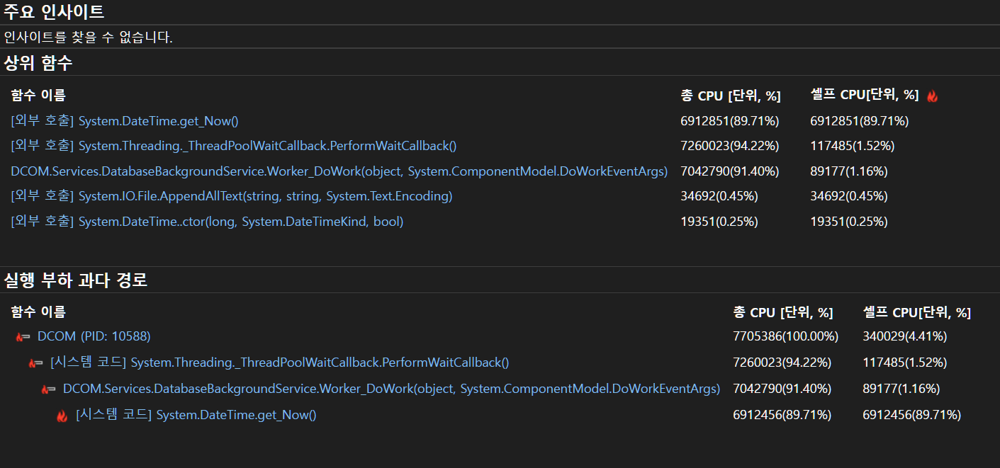
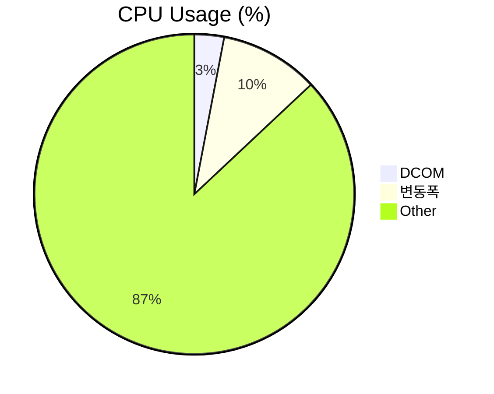
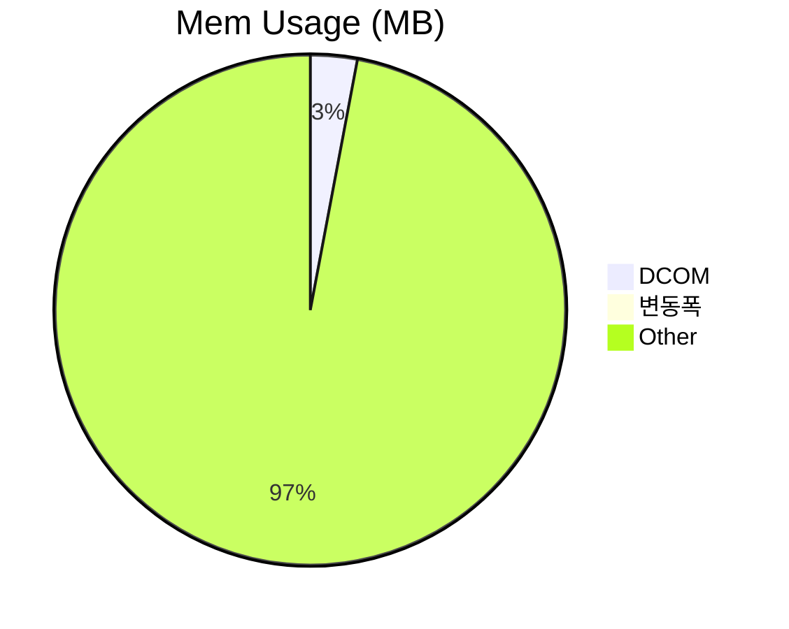
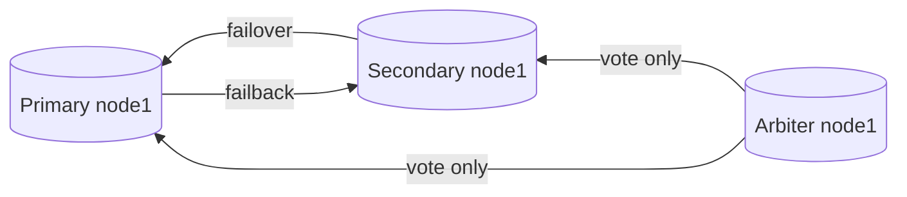

##   성능 테스트 보고서
    
      
**프로젝트 정보:**  
    
-   프로젝트 이름: DCOM
-   테스트 날짜: 2023-09-05
-   테스트 버전:
	- bbab62eebb8fb78c0ecb0200093132470f1bf27d (dev)
    
      
  **목표와 요약:**  
    
-   성능 테스트의 목표: 메모리누수 탐지 부하 과다경로 탐색
-   테스트 결과 요약: ***누수없음***, ***DatabaseBackgroundService에서 병목***
    ```mermaid 
    pie
    title CPU Usage (%)
    "Dcom" : 25
    "변동폭" : 7
    "Other" : 70
    ```
    ```mermaid 
    pie
    title Mem Usage (MB)
    "Dcom" : 158
    "변동폭": 30
    "Other" : 8000
    ```
    
      
**테스트 환경:**  
    
-   운영 체제: Win 10 pro
-   CPU: i3 6300
-   RAM: 8 Gb
-   그래픽 카드: N/A
-   .NET Framework 버전: 4.7.2
    
      
**테스트 시나리오:**  
    
-   테스트 시나리오 설명:  ***프로그램을 시작하며 메인화면에서 Idle상태 유지***
-   사용된 데이터 또는 시나리오:
	- [x] release 빌드 옵션으로 성능프로파일러 실행
	- [x] 메모리 사용량 기록
	- [x] 파일 읽기/ 쓰기 기록
	- [x] CPU사용량 기록
	- [x] 실행 부하 과다경로 탐색

**성능 측정 및 결과:**
-   테스트 시간: 2h
-   화면 응답 시간: 2h
-   CPU 사용률: 25~30 %
-   메모리 사용: 158 ~188 MB
-   네트워크 사용 (필요한 경우): 0.1 Mbps
    
      
**성능 문제 식별:**  
    
-   발견된 성능 문제:  ***실행 부하 과다 경로***
	|| + DCOM.Services.DatabaseBackgroundService.Worker_DoWork(object, System.ComponentModel.DoWorkEventArgs)	7042790(91.40%)


	
-   문제의 원인 분석: Loop주기가 매우 빠름. 다른 스레드에게 CPU Yield가 필요
-   추가 세부 정보: UI가 아닌 Background이기 때문에 Thread.Sleep()사용시 프리징 없이 효과적으로 CPU사용률을 낮출 수 있음.
      
**문제 해결 및 최적화:**  
    
-   채택된 해결책: Thread.Sleep()의 사용.
-   최적화된 코드 또는 구조 변경 내용:

```csharp:DatabaseBackgroundService.cs
 // 백그라운드 작업 수행
 while (!worker.CancellationPending)
 {
     if (_enableWhileLoop)
     {
         // DB작업시 메인스레드의 네트워크작업에 제동걸림 DB와 관련없는 작업돌릴것.  
         var passageOfTime = DateTime.Now - _lastLoofTime;
         if (passageOfTime > OneTick)
         {
             var previous = _role;
             CheckRole();
             if (_role != previous)
             {
                 string json = $"{{\"previous\":\"{previous}\"}},{{\"changed\":\"{_role}\"}}";
                 object fulldocument = BsonDocument.TryParse(json, out BsonDocument bson) ? (object)bson : (object)json;
                 var sucess =_databaseManager.Insert(DATABASE_NAME, COLLECTION_FAILOVER, new BsonDocument(new KeyValuePair<string, object>[]
                 {
                     new KeyValuePair<string, object>("_id", ObjectId.GenerateNewId()),
                     new KeyValuePair<string, object>("specification", "Changed system-role"),
                     new KeyValuePair<string, object>(FIELD_FULLDOCUMENT, fulldocument),
                     new KeyValuePair<string, object>("createdAt", DateTime.Now),
                     new KeyValuePair<string, object>("createdBy", System.Net.Dns.GetHostName())
                 }));
                 DCOMInformation.Log.WriteLog($"The system has been changed by failover ({json}) [{System.Net.Dns.GetHostName()}]", this.GetType().Name, "Database", LogManager.KindLog.Debug);
             }
             _lastLoofTime = DateTime.Now;
         }
     }
     //코드추가 **변경**
     Thread.Sleep(OneTick);
 }
```
-   성능 향상 결과: **Mem 소폭상승,  but CPU 대폭하락**


      
**추가 테스트 및 작업:**  
    
-   추가 테스트 또는 작업 요청 (필요한 경우): ***파일 읽기/쓰기는 크게 영향이 없으므로 다음 테스트 부터는 제외***
      
**결론:**  
    
-   성능 테스트 결과에 대한 종합적인 결론: 
	-  되게 사소한 한줄로 기존 CPU사용률의 70% ~ 90%를 절감했다. 
	- 원인은 비동기쓰레드에서의 Loop였고, ~~백그라운드 라이브러리 사용으로 커널에서 CPU가 IDLE상태일 때 동작한다는~~ 믿음은 깨졌다. 
	- 실행 부하 과다 경로가 만약 시스템 코드나 Nuget라이브러리 코드가 아닌, **우리가 작성한 코드**면 포기하지 않고 개선 해야할 것.
	- 메모리사용량은 소폭 상승했으나 허용할 만한 수준이므로, 이 후 테스트의 경과를 관망 후 조치 하기위해 보류한다.
      
**다음 단계:**  
    
-   추가 작업 또는 개선사항에 대한 계획: 메인메뉴버튼을 누르면서 성능분석
      
**서명:**  

-   보고서 작성자: 주호연
-   작성일: 2023-09-05

# MongoDB Replica Set 구성


## Primary Node1
- Host: ICMS1
- Port: 27017
- 상태: Primary
- 역할: 데이터 쓰기 가능

## Secondary Node1
- Host: ICMS2
- Port: 27017
- 상태: Secondary
- 역할: 데이터 복제 및 읽기 가능

## Arbiter Node1
- Host: ICMS3
- Port: 27017
- 상태: Arbiter
- 역할: 투표자 (데이터 복제 불가능)


