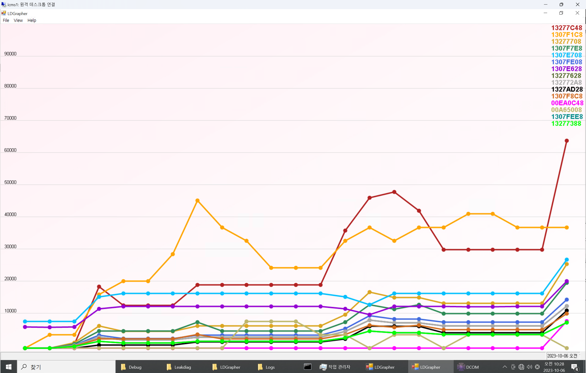
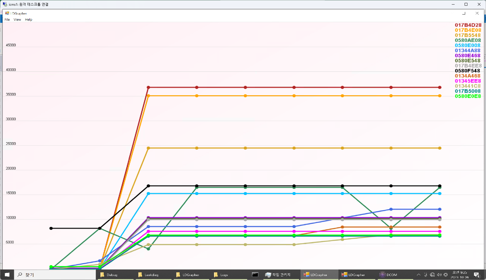

##   성능 테스트 보고서
    
      
**프로젝트 정보:**  
    
-   프로젝트 이름: DCOM
-   테스트 날짜: 2023-10-05
-   테스트 버전:
	- dc8c7a85c4d07ef0ea9b5a6d64a03d5b90e6c896 (dev)
    
      
  **목표와 요약:**  
    
-   성능 테스트의 목표: LeakDiag를 이용한 메모리누수 탐지 
-   테스트 결과 요약: ***누수가 없거나 매우 미세하여 장기적인 모니터링 필요***
    ```mermaid 
    pie
    title CPU Usage (%)
    "Dcom" : 1.5
    "변동폭" : 3
    "Other" : 95.5
    ```
    ```mermaid 
    pie
    title Mem Usage (MB)
    "Dcom" : 130
    "변동폭": 70
    "Other" : 8000
    ```
    
      
**테스트 환경:**  
    
-   운영 체제: Win 10 pro
-   CPU: i3 6300
-   RAM: 8 Gb
-   그래픽 카드: N/A
-   .NET Framework 버전: 4.7.2    
      
**테스트 시나리오:**  
    
-   테스트 시나리오 설명:  ***프로그램실행 후 Leakdiag로 스냅샷 수집 후 LDGrapher로 분석***
-   사용된 데이터 또는 시나리오:
	- [x] release 빌드 옵션으로 성능프로파일러 실행
	- [x] 메모리 사용량 기록
	- [x] 파일 읽기/ 쓰기 기록
	- [x] CPU사용량 기록
	- [x] 실행 부하 과다경로 탐색

**성능 측정 및 결과:**
-   테스트 시간: 8h
-   화면 응답 시간: 8h
-   CPU 사용률: 1.5 % ~ 3%
-   메모리 사용: 130 ~200 MB
-   네트워크 사용 (필요한 경우): 0.1 Mbps
      
**성능 문제 식별:**  
    
-   발견된 성능 문제:  **작업 집합 델타 변동이 큼**

](../images/Leakdiag 측정_Heap Allocator.png)

	CLR.DLL 에서의 Windows Heap Allocator 증감 폭이 크며, 패턴화 되어 있다.
	
-   문제의 원인 분석: string 객체의 += 연산자가 for loop속에서 실행 되는 코드가 너무 많음. 또 한 높은 빈도로 실행됨.
-   추가 세부 정보: string 객체는 **immutable** 특성을 가지므로 매번 string 객체의 생성이 갱신됨. GC가 버려진 객체를 메모리 해제하기 위해 많은 메모리가 필요함.
      
**문제 해결 및 최적화:**  
    
-   채택된 해결책: StringBuilder 객체와 Append() 사용.
-   최적화된 코드 또는 구조 변경 내용:


```csharp : ComConverter.cs
 // 변경 전
 public static string ByteArrayToHexString(byte[] source)
        {
            string result = "";
            foreach (byte num in source)
            {
                result += DecToHex(num);
            }
            return result;
        }
```

```csharp : ComConverter.cs
 // 변경 후
 public static string ByteArrayToHexString(byte[] source)
        {
            StringBuilder result = new StringBuilder();
            foreach (byte num in source)
            {
                result.Append(DecToHex(num));
            }
            return result.ToString();
        }
```

#### Commit Summary

-   [1d0a8be](https://github.com/HANLAIMS/RD136-SW-DCOM/pull/60/commits/1d0a8be305d51f45ef5bddcdd00e21baeda32972)  [Modify] 코드리팩토링!! (변경파일 9개, 보류 2개)

#### File Changes

([9 files](https://github.com/HANLAIMS/RD136-SW-DCOM/pull/60/files))

-   **M**  [DCOM/Globals/ArraySet.cs](https://github.com/HANLAIMS/RD136-SW-DCOM/pull/60/files#diff-54c19923e6003ed40f649817bc6b202e21544cf35f32c2b14c94dee989fc6efb)  (17)
-   **M**  [DCOM/Globals/ComConverter.cs](https://github.com/HANLAIMS/RD136-SW-DCOM/pull/60/files#diff-b4439981469498748beb647e1dcb17b678b02d299e34c0e8cc5b67ecf98b911d)  (14)
-   **M**  [DCOM/Interfaces/HControllerTCP.cs](https://github.com/HANLAIMS/RD136-SW-DCOM/pull/60/files#diff-014bfcbfe7b2cfb889c31e61cd8552c81f817df91248169bf2bfc94e4c781842)  (7)
-   **M**  [DCOM/Interfaces/Parsers/GlobalParser.cs](https://github.com/HANLAIMS/RD136-SW-DCOM/pull/60/files#diff-cc7e6beb126244ccd6373b59712b73ce95d785abc8d81ca3dc889c77d076c86a)  (10)
-   **M**  [DCOM/Interfaces/Protocols/HControllerProtocol.cs](https://github.com/HANLAIMS/RD136-SW-DCOM/pull/60/files#diff-caa2c0402cf17c4827e3e0811e4765031fbe3a6b84b5b719de5a3ca79c4e8cec)  (84)
-   **M**  [DCOM/Interfaces/Protocols/InternalProtocol.cs](https://github.com/HANLAIMS/RD136-SW-DCOM/pull/60/files#diff-49ec0568ff58065bfd66e140c0f7877190cec61bac727740b4f44bd5360d4a11)  (56)
-   **M**  [DCOM/Interfaces/Protocols/ModbusProtocol.cs](https://github.com/HANLAIMS/RD136-SW-DCOM/pull/60/files#diff-b9780439b6c5e3bcfe4657c1c15a2aa9eedad9bff97a034e36adbccecada1b9e)  (76)
-   **M**  [DCOM/Modules/Channels/ChannelBase.cs](https://github.com/HANLAIMS/RD136-SW-DCOM/pull/60/files#diff-d62099d9e2c598ea693ee60007e323978d92d4a8ac7e3b135ef99831848ef760)  (22)
-   **M**  [DCOM/Views/MainWindowView.xaml.cs](https://github.com/HANLAIMS/RD136-SW-DCOM/pull/60/files#diff-a3103d9d50614b6182ddda9e7b2c00d4b1382c44ac038a1f2329fbb8f38e2554)  (6)

-   성능 향상 결과: **변동폭 개선**

      
**추가 테스트 및 작업:**  
    
-   추가 테스트 또는 작업 요청 : 일단위로 체크밑 기록 필요 ***최고 작업 집합(메모리)***
      
**결론:**  
    
-   성능 테스트 결과에 대한 종합적인 결론: 
	-  코드 리팩토링으로 작업 집합 델타의 변동 파형을 다소 안정화 시킴. 추후 메모리 누수에 대한 인사이트 확보에 유리
	- 메모리사용량은 소폭 상승이 의심되나 허용할 만한 수준이므로, 이 후 경과를 관망 
      
**다음 단계:**  
    
-   DCOM의 모든 기능을 활성화한 상태로 메모리사용량 경과마다 체크
      
**서명:**  

-   보고서 작성자: 주호연
-   작성일: 2023-10-06

> Written with [StackEdit](https://stackedit.io/).
